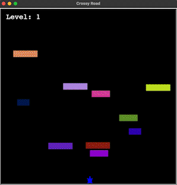

# Crossy Road

## Description

In this game, the objective is to navigate across a busy road without being struck by passing vehicles. The player can move in all four cardinal directions: up, down, left, and right. As they progress, there is a chance (5%) of encountering randomly generated coins which increase their speed upon collection. However, colliding with any of the cars results in an instant loss. On successfully reaching the other side, the level increases, and an additional car is added to the traffic. The aim is to complete as many crossings as possible while avoiding collisions.
## How to Play
- Use 'w', 'a' 's', and 'd' to move up, left, down, and right respectively.
- Collect coins to increase your speed.
- Don't get hit by the cars!
- Get to the other side to win!
- Press 'esc' to quit.

